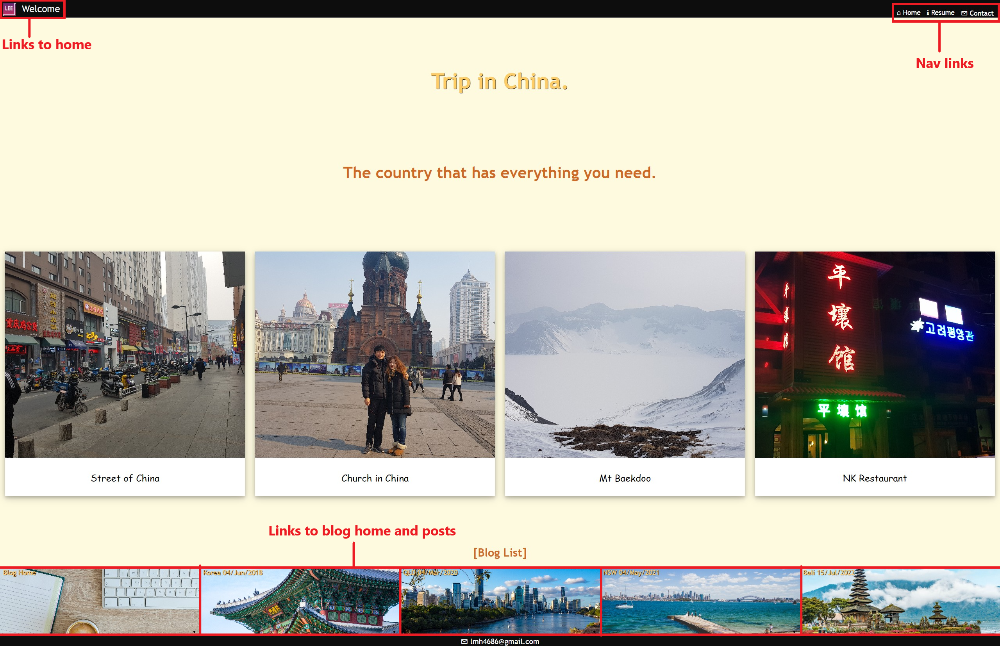
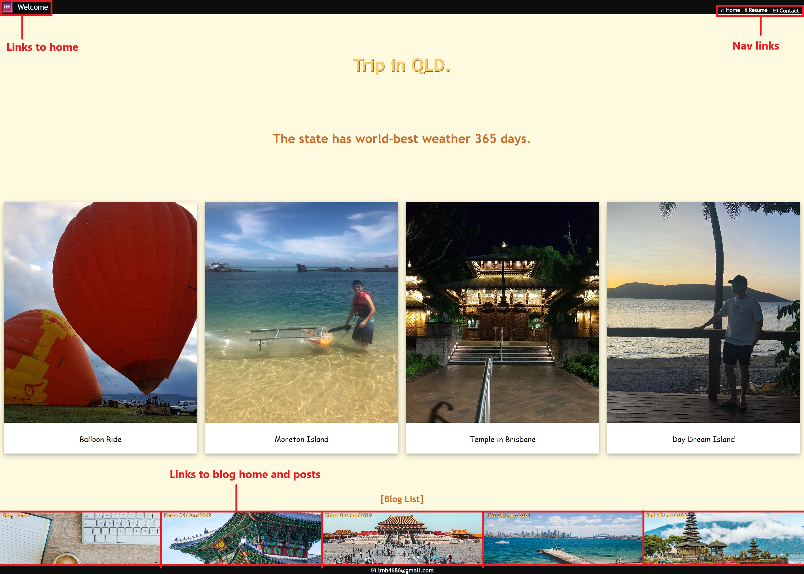

# [Portfolio Web site](https://stupendous-gecko-9787d1.netlify.app/)
# [Presentation link](https://youtu.be/k3bUuUAoGO8)
# [GitHub link](https://github.com/lmh4686?tab=repositories)
  
## This web site is built to show my web development skills to future employers. CSS, HTML were used for building and Netify was used for deployment. The main design concept is minimalistic design, consist of big background image and few text. Every link except logo on the header has hover over effect. This web site has total 9 pages. Home, Blog, Resume and Contact pages are linked on the top navigation bar on all the web pages. In the Blog-home page, 5 of blog posts list is located at the bottom in image form. And all the blog posts share same structure and design. Thank you for watching.
***
# ---Sitemap---

# Landing(index) page

# Resume page

# Contact page

# Blog home page

# Blog-Korea page (All blog pages share same structure)

# Blog-China page

# Blog-QLD page

# Blog-NSW page

# Blog-Bali page
